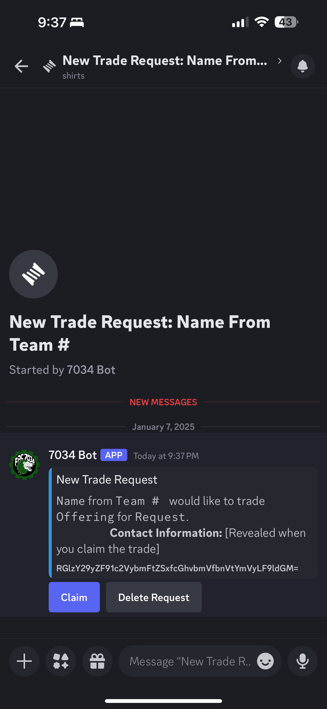
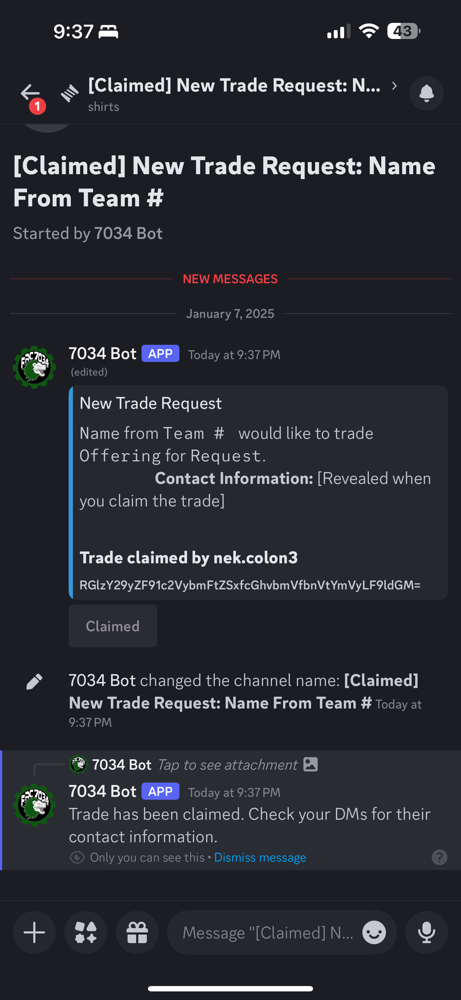
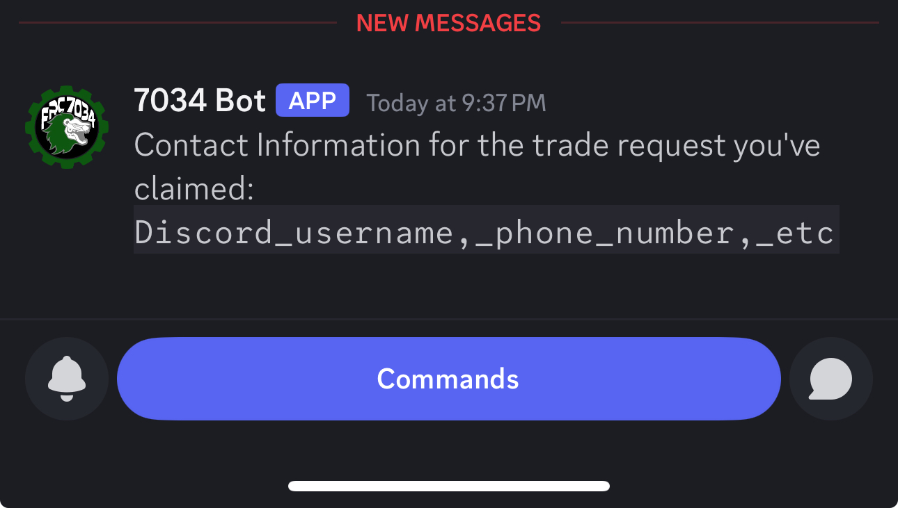

# Nebulix

Nebulix is a project that integrates with Discord to handle trade requests for FIRST FRC shirt/goods trading. This project is built using TypeScript and Node.js. It is designed to simplify the trading process and prioritize first-come, first-serve.

## Purpose

The purpose of Nebulix is to streamline the process of trading FIRST FRC shirts and goods by automating the creation and management of trade requests through a Discord bot. This ensures a fair and efficient trading experience for all users.

## Features

- **Create Trade Request Threads in Discord**: Automatically create threads in a specified Discord channel for each trade request.
- **Automated Trade Request Management**: Manage trade requests by handling user interactions and updating the status of trades.
- **User-Friendly Interaction Handling**: Provide an easy-to-use interface for users to submit trade requests and interact with the bot.
- **Form Validation**: Ensure all required fields are filled out before allowing form submission.
- **ReCaptcha Integration**: Implement ReCaptcha to prevent spamming of requests and ensure only genuine submissions.

## Examples







## Getting Started

### Prerequisites

- Node.js
- npm

### Installation

1. Clone the repository:
    ```sh
    git clone https://github.com/Ne-k/Nebulix.git
    cd Nebulix
    ```

2. Install dependencies:
    ```sh
    npm install
    ```

3. Create a `.env` file in the root directory and add your environment variables:
    ```dotenv
    DISCORD_BOT_TOKEN=your_discord_bot_token
    DISCORD_CHANNEL_ID=your_discord_channel_id
    GITHUB_REPO_URL=https://github.com/Ne-k/Nebulix
    RECAPTCHA_SITE_KEY=your_recaptcha_site_key
    RECAPTCHA_SECRET_KEY=your_recaptcha_secret_key
    GOOGLE_CLOUD_PROJECT_ID=your_google_cloud_project_id
    GOOGLE_PROJECT_ID=your_google_project_id
    GOOGLE_PRIVATE_KEY=your_google_private_key
    GOOGLE_CLIENT_EMAIL=your_google_client_email
    ```
   > There are two instances in the code where you'll have to change the site key, this will likely get changed in the future:
   > - One at [index.html#L13](https://github.com/Ne-k/Nebulix/blob/47ab5400104382d2dfafe75f6423d5e36a60c61f/index.html#L13)
   > - The other at [main.ts#L80](https://github.com/Ne-k/Nebulix/blob/47ab5400104382d2dfafe75f6423d5e36a60c61f/src/main.ts#L80)


### Obtaining Environment Variables

#### Discord Bot Token and Channel ID

1. Go to the [Discord Developer Portal](https://discord.com/developers/applications).
2. Create a new application and add a bot to it.
3. Copy the bot token from the bot settings page.
4. Add the bot to your server and obtain the channel ID where you want to manage trade requests.

#### Google Cloud Credentials

1. Go to the [Google Cloud Console](https://console.cloud.google.com/).
2. Create a new project or select an existing one.
3. Navigate to the "APIs & Services" > "Credentials" page.
4. Click on "Create Credentials" and select "Service Account".
5. Follow the prompts to create a service account and download the JSON key file.
6. Extract the necessary information from the JSON key file and add it to your `.env` file. This includes `GOOGLE_CLOUD_PROJECT_ID`, `GOOGLE_PROJECT_ID`, `GOOGLE_PRIVATE_KEY`, and `GOOGLE_CLIENT_EMAIL`.

#### ReCaptcha Keys

1. Go to the [Google reCAPTCHA Admin Console](https://www.google.com/recaptcha/admin).
2. Register a new site and choose reCAPTCHA v2 or v3.
3. Add your domain and obtain the site key and secret key.
4. Add these keys to your `.env` file as `RECAPTCHA_SITE_KEY` and `RECAPTCHA_SECRET_KEY`.

4. Run the project:
    ```sh
    npm start
    ```

## Usage

### How the Project Works

The project consists of two main parts:

1. **Website End**: This part of the system creates the Discord channel thread and sends a message with a trade request. It is handled by the `api/sendWebhook.ts` file.
2. **Interaction Handling**: This part handles the interaction when a user clicks the "Claim" button in the Discord message. It is handled by the `Discord/InteractionCreate.example.js` file.

### Using `Examples/Discord/InteractionCreate.example.js`

To use the `Examples/Discord/InteractionCreate.example.js` file, follow these steps:

1. Ensure your Discord bot is set up to handle interactions. This typically involves setting up an event listener for interactions in your bot's main file.

2. Ensure your bot has the necessary permissions to create threads and send messages in the specified channel.

**Note:** The `Examples/Discord/InteractionCreate.example.js` file is meant to be an example or a rough idea of the interaction handling side of the bot and may be implemented differently depending on your bot structure.

## Laundry List

- [ ] Implement ReCaptcha to prevent spamming of requests
- [ ] Implement the delete request button

## Contributing

Please read the [CONTRIBUTING.md](CONTRIBUTING.md) for details on our code of conduct and the process for submitting pull requests.

## License

This project is licensed under the MIT License - see the [LICENSE](LICENSE) file for details.
